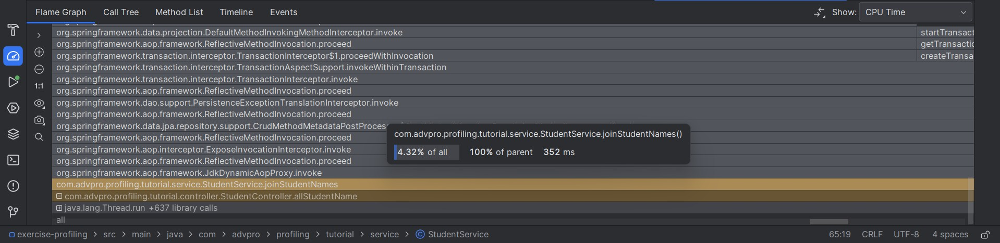

# Advanced Programming Module Reflections

## Module 05 - Java Profiling

### Performance Testing Results
#### JMeter GUI
##### /all-student-name endpoint
| Listener | Result |
|--|--|
| View Results Tree |  |
| View Results In Table | |
| Summary Report | |
| Graph Results | |

##### /highest-gpa endpoint
| Listener | Result |
|--|--|
| View Results Tree |  |
| View Results In Table |  |
| Summary Report |  |
| Graph Results |  |

#### JMeter CLI
| Endpoint | Command Line | Result Log |
|--|--|--|
| /all-student-name |  |  |
| /highest-gpa |  |  |

### Profiling
#### Optimized getAllStudentsWithCourses() Method
| Before | After |
|--|--|
|  |  |
```angular2html
Problem:
This segment `(findByStudentId(student.getId())` made many database calls in a loop, leading to a N+1 query problem
Solution:
The new code uses `(findAll())` collects all student-course mappings in one call, groups them by student ID and then uses a Map for faster retrieval
Conclusion:
There's 96.19% improvement in performance from 23102 ms to 880 ms
```

#### Optimized findStudentWithHighestGpa() Method
| Before | After |
|--|--|
|  |  |
```angular2html
Problem:
The previous code iterated through all students one by one to find the highest GPA
Solution:
The segment `stream().max(Comparator.comparingDouble(Student::getGpa))` results in better stream processing
Conclusion:
There's 68.38% improvement in performance from 1442 ms to 456 ms
```

#### Optimized joinStudentNames() Method
| Before | After |
|--|--|
|  |  |
```angular2html
Problem:
The old code uses the segment `(result += student.getName() + ", ")` which uses immutable string operations
Solution
The new code uses the segment `Collectors.joining(", ")` with a stream that's faster and more memory-efficient
Conclusion:
There's 89.41% improvement in performance from 3,324 ms to 352 ms
```

#### JMeter Profiling
##### /all-student endpoint
| Listener | Before | After |
|--|--|--|
| View Results Tree |  |  |
| View Results In Table |  |  |
| Summary Report |  |  |
| Graph Results |  |  |

##### /all-student-name endpoint
| Listener | Before | After |
|--|--|--|
| View Results Tree |  |  |
| View Results In Table |  |  |
| Summary Report |  |  |
| Graph Results |  |  |

##### /highest-gpa endpoint
| Listener | Before | After |
|--|--|--|
| View Results Tree |  |  |
| View Results In Table |  |  |
| Summary Report |  |  |
| Graph Results |  |  |


### Reflection
#### Q 1:
What is the difference between the approach of performance testing with JMeter and profiling with IntelliJ Profiler in the context of optimizing application performance?
```
Both program test in different ways. For JMeter it creates dummy users, creating load
and then tests the overall application performance.
While profiles the system performance and shows bottlenecks by measuring CPU usage and
time and execution time.
```

#### Q 2:
How does the profiling process help you in identifying and understanding the weak points in your application?
```
Profiling helps me identify which lines of codes or functions have slow performance or long run times.
These functions usually affect the CPU time or usage and total time. After identifying I can optimize
the identified code and functions that are affecting the application's performance.
```

#### Q 3:
Do you think IntelliJ Profiler is effective in assisting you to analyze and identify bottlenecks in your application code?
```
Yes I think the Profiler is very effective because it directly highlights which methods have 
poor performance in the FlameGraph and can directly take me to the file they're located in.
It also has a comparison tool that calculates performance increase between different
profiling sessions.
```

#### Q 4:
What are the main challenges you face when conducting performance testing and profiling, and how do you overcome these challenges?
```
The main challenge of performance testing is very long test times when testing functions with
a large number of data. Besides just waiting, to make the tests run as fast as possible 
I had to close unnecessary browsers and applications so my computer can use more resources for testing.
```

#### Q 5:
What are the main benefits you gain from using IntelliJ Profiler for profiling your application code?
```
It can help me find the exact methods or lines of code that have poor performance,
leading to faster optimization.
Since IntelliJ already comes with it there's no need to install an external profiler,
and not creating tests manually additionally saves time unlike in JMeter.
```

#### Q 6:
How do you handle situations where the results from profiling with IntelliJ Profiler are not entirely consistent with findings from performance testing using JMeter?
```
I retry profiling in both IntelliJ and JMeter and compare the findings. If the results
still don't match up then I try refactoring the code and retry profiling in both programs.
```

#### Q 7:
What strategies do you implement in optimizing application code after analyzing results from performance testing and profiling? How do you ensure the changes you make do not affect the application's functionality?
```
To check if the functionality is affected I try running a clean maven build which will fail
the build if there's an issue in the code. From there I can refactor the code until the
application can build and run successfully.

Other strategies include:
Optimizing methods that have poor performance one at a time, if the improvement is not
significant then I optimize the method again until the difference in performance is
high. For example improving the methods that query the database with maps and indexing.
Minimizing use of loops in methods because they result in poor performance.
```
